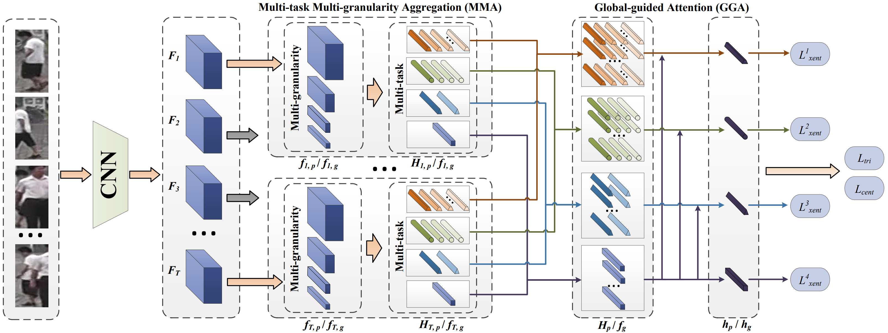
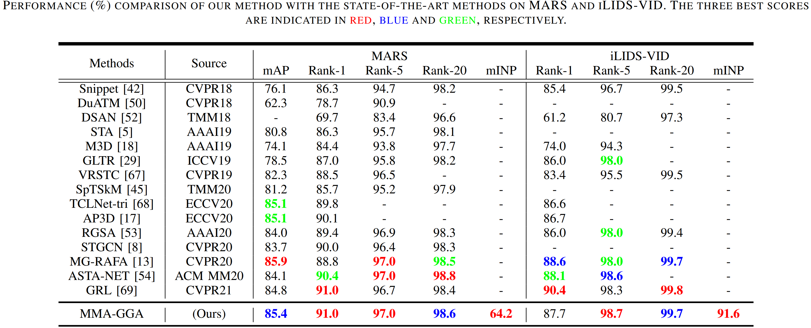
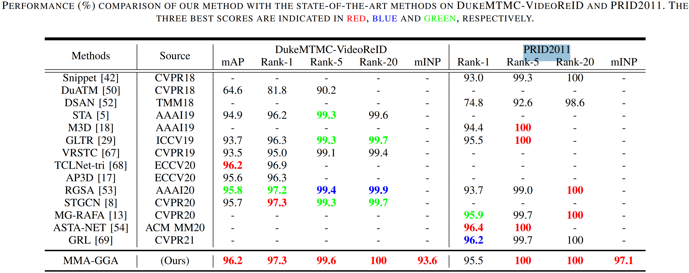

# MMA-GGA
Official PyTorch implementation of the paper ["Multi-task Multi-granularity Aggregation with Global-guided Attention for Video Person Re-Identification"](https://ieeexplore.ieee.org/document/9795316)

## Abstract
The goal of video-based person re-identification (Re-ID) is to identify the same person across multiple non-overlapping cameras. The key to accomplishing this challenging task is to sufficiently exploit both spatial and temporal cues in video sequences. However, most current methods are incapable of accurately locating semantic regions or efficiently filtering discriminative spatio-temporal features; so it is difficult to handle issues such as spatial misalignment and occlusion. Thus, we propose a novel feature aggregation framework, multi-task and multi-granularity aggregation with global-guided attention (MMA-GGA), which aims to adaptively generate more representative spatio-temporal aggregation features. Specifically, we develop a multi-task multi-granularity aggregation (MMA) module to extract features at different locations and scales to identify key semantic-aware regions that are robust to spatial misalignment. Then, to determine the importance of the multi-granular semantic information, we propose a global-guided attention (GGA) mechanism to learn weights based on the global features of the video sequence, allowing our framework to identify stable local features while ignoring occlusions. Therefore, the MMA-GGA framework can efficiently and effectively capture more robust and representative features. Extensive experiments on four benchmark datasets demonstrate that our MMA-GGA framework outperforms current state-of-the-art methods. In particular, our method achieves a rank-1 accuracy of 91.0% on the MARS dataset, the most widely used database, significantly outperforming existing methods.

## Architecture
Overview of the proposed model. The structure of our Multi-task Multi-granularity Aggregation with Global-guided attention framework.


## Results on MARS and iLIDS-VID:


## Results on DukeMTMC-VideoReID and PRID2011:



# BibTex
```
@ARTICLE{9795316,
  author={Sun, Dengdi and Huang, Jiale and Hu, Lei and Tang, Jin and Ding, Zhuanlian},
  journal={IEEE Transactions on Circuits and Systems for Video Technology}, 
  title={Multi-task Multi-granularity Aggregation with Global-guided Attention for Video Person Re-Identification}, 
  year={2022},
  volume={},
  number={},
  pages={1-1},
  doi={10.1109/TCSVT.2022.3183011}}

```
